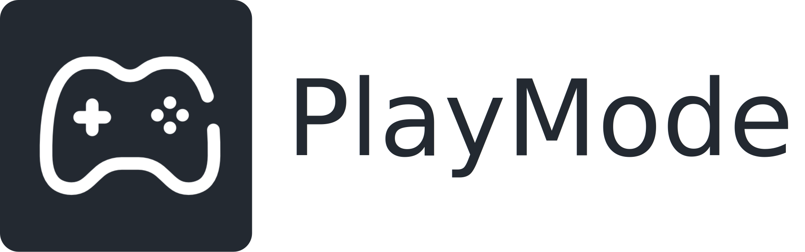

<h1 align="center">
   
  
   
</h1>

<h4 align="center">
  PlayMode is a configuration script that restructures your Windows environment to create an immersive, gamepad-friendly user interface inspired by SteamOS and BazziteOS.
    
  The project is built around Playnite, an open-source game launcher, and adds a series of customizations and tools for an optimal "couch gaming" experience.
</h4>

 <!-- Language -->
  
  <!-- Platform -->
  
  <!-- License -->
  
  <!-- Downloads -->
  
  <!-- Stars -->
  

  <a href="#project-vision">Project Vision</a> •
  <a href="#features">Features</a> •
  <a href="#requirements">Requirements</a> •
  <a href="#installation">Installation</a> •
  <a href="#usage">Usage</a> •
  <a href="#amd-gpu-users">AMD GPU Users</a> •
  <a href="#handheld-device">Handheld Device</a> •
  <a href="#known-issues">Known Issues</a> •
  <a href="#credits">Credits</a> •
  <a href="#license">License</a> •
  <a href="#show-your-support">Show Your Support</a> 

  <!-- GIF big -->
  
  
  <!-- GIFS small -->
  
  

  <strong>Note:</strong> This is an example of a complete setup with all additional features installed.  
  Everything shown in these GIFs is fully controlled with a gamepad.  
  The theme used here is <a href="https://github.com/And360red/Solaris" target="_blank"><em>Solaris</em></a>.

## Project Vision

The goal of **PlayMode** is to provide a **simple and elegant** solution for those who want to turn a PC into a gaming console, with an interface that can be **fully controlled with a gamepad**. The project is built around **[Playnite](https://playnite.link/)** to unify your game libraries and automates a series of configurations for maximum immersion right from startup.

## Features

- **Unified Interface**: Brings together all your games (Steam, Epic, GOG, emulators...) in one place using **[Playnite](https://playnite.link/)**.

- **Full Gamepad Control**: Navigate the desktop and control the mouse with **[JoyXoff](https://joyxoff.com/en/)** integration.

- **Auto Startup**: Launches Playnite in fullscreen mode at Windows startup for an instant console-like experience through a custom shell replacement.

- **Windows Optimization**: Applies light debloating and system tweaks to improve gaming performance using this **[repository](https://github.com/Raphire/Win11Debloat)**.

- **Custom Sleep Mode**: Offers a tailored sleep solution, ideal for OLED screens based on video format from the folder "SleepVideos" on the default video folder from the user.

- **Visual Customization**: Optional animated wallpaper via **[Lively Wallpaper](https://apps.microsoft.com/detail/9ntm2qc6qws7?hl=en-US&gl=US)** and a **[custom cursor](https://www.deviantart.com/jepricreations/art/Windows-11-Cursors-Concept-886489356)** for a polished look.

- **Handheld Device Power Management**: This functionality optimizes power management by setting sleep after 1 minutes and hibernation after 3 minutes on both battery and AC power. It customizes the power button so a short press triggers hibernation and a long press triggers shutdown.

> ⚠️ **IMPORTANT WARNING** ⚠️   
> Gamepad macros, as well as configurations for Lively Wallpaper and Playnite, are **not included** in the script. You will need to set them up manually.  
> Many YouTube tutorials are available to help with these steps.  
> These features may be considered in future updates.

## Requirements

Before starting the installation, make sure you meet the following conditions:

1. **Operating System**: Windows 11.

2. **System State**: It is **strongly recommended** to run this script on a **fresh and fully updated** Windows installation to avoid potential conflicts.  
   Otherwise, consider **creating a restore point** in case something goes wrong during installation.

3. **User Account**: You must **ABSOLUTELY** be using a **local administrator account**.  
   This means one of the following:
   - You installed Windows 11 **without an Internet connection**, which created a **local account**,  
   - Or you are using an existing **local administrator account** (not a Microsoft online account).

   If you are not using a local administrator account, the script may **fail** or cause **system errors**.

## Installation

1. Go to the **[Releases](https://github.com/Sanko-kf/PlayMode/releases/tag/v1.0.0)** page of this project.

2. Download the `.exe` file.

3. Run the installer — it will automatically install and launch the necessary scripts.

It is highly recommended to follow **Part 1** and then **Part 2** of the script.  
The installation should run smoothly, but for visual learners, **[a video tutorial is avaible](https://youtu.be/gGRgdIMSxxs)** to guide you through the process. This process was originally based on Controller Companion and don't include handheld device update. Thanks to a helpful suggestion from the community on Reddit, it has now been updated to rely entirely on a free and alternative.

### Handheld device

For handheld devices, **do not install JoyXoff and optional features during Part 2** of the installation process. Instead, it is **mandatory to run Part 3** at the end before exiting the installer. This ensures proper configuration tailored for portable hardware like the ROG Ally/Legion Go. (See [Handheld Device](#handheld-device) for more details.)

## Usage

Once the installation is complete, your PC will automatically restart.  
On the next boot, **PlayMode will finalize the environment setup automatically**, launching directly into fullscreen mode.

> **Important Setup Step**  
> To ensure a seamless, 100% gamepad-driven experience, you should configure all your controller bindings **right after the first boot**.  
> This includes mouse control, keyboard shortcuts, and paddle assignments (if applicable).  
>  
> This will help you avoid needing a mouse or keyboard later, and reduce the risk of issues caused by apps like JoyXoff or Microsoft overlays.  
> (See [Known Issues](#known-issues) for more details.)

> Using a gamepad with paddles or additional buttons provides a more natural and fluid experience.  
> You are free to map the buttons however you prefer — except for **Start + Select**, which remains universal at startup.  
> Below is a list of commonly used controls, including how I personally mapped my paddles using the Xbox Accessories app.

| **Action**                            | **Gamepad Command**                                          |
|--------------------------------------|--------------------------------------------------------------|
| Toggle mouse control                 | Press **Start + Select**                                     |
| Show virtual keyboard                | Press **L3** (Right Stick Click)                             |
| Left click                           | **X / A** (depending on your controller layout)              |
| Activate Lossless Scaling            | **P1 → Ctrl + Alt + Z**                                      |
| Perform Alt + Tab                    | **P2 → Alt + Tab**                                           |
| Quit a game instantly                | **P3 → Alt + F4**                                            |

> **Note**: P1, P2, and P3 refer to the paddle buttons on my gamepad.

## AMD GPU Users

While PlayMode works on all configurations, **users with AMD hardware** may enjoy an even more integrated experience by using **[BazziteOS](https://bazzite.gg/)** — an excellent Linux-based alternative designed specifically for gaming and **much more native and optimized** for such systems.

## Handheld Device

PlayMode is now fully compatible with portable devices such as laptops, handheld gaming consoles like the ASUS ROG Ally, Legion Go, and similar platforms.

On this type of device, I strongly recommend prioritizing battery life for optimal comfort. To achieve this:

- The sleep and hibernation behavior has been adjusted to be more aggressive. While this understand it may seem abrupt, the shorter delay significantly improves battery efficiency.

- For better system responsiveness, I advise users to run a more advanced debloater than the default one, in order to remove unnecessary background processes.

## Known Issues

- **Admin permission windows not responsive to controller input**  
  In some cases, User Account Control (UAC) prompts cannot be confirmed using a gamepad.  
  **Solution**: Change your user account settings to automatically accept all UAC prompts.  
  **This is only recommended if you're installing software from trusted sources like Steam, Microsoft, ...**  
  You can adjust this permanently in the Control Panel:  
  Go to **User Accounts > User Accounts > Change User Account Control settings**, then drag the slider down to **Never notify**, and click OK. (This step is also shown in the installation video.)   
  Instead of disabling UAC system-wide, you can use JoyXoff's built-in feature to manage the prompts but is not as smooth than the first option.

- **Partial gamepad support in some Microsoft apps**  
  Certain Microsoft apps (such as Microsoft Store or Settings) have limited controller support.  
  This can disable the virtual keyboard or prevent full navigation.  
  **No known solution** for this at the moment.

- **Double input in Playnite with JoyXoff**  
  If **JoyXoff** is active while using Playnite, some actions may result in duplicated input  
  (e.g., a single button press may trigger two actions or open two windows).  
  **Solution**: Temporarily disable JoyXoff by pressing **Start + Select**.

- **Occasional Xbox Game Bar overlay pop-up**  
  Sometimes, the **Game Bar overlay** may briefly appear even if it is disabled in settings.  
  **Temporary solution**: Simply press any button to dismiss it. It does not cause any real issue and can be bypassed easily.

- **Delayed desktop appearance due to modified shell behavior**  
  The system shell is modified to first launch Playnite on startup for aesthetic and immersion purposes.  
  Only after Playnite has fully initialized does the Windows desktop appear — usually after about **20 seconds**.  
  
  In rare cases, certain applications may update or open unexpectedly during this phase, or **JoyXoff** may auto-launch and interfere with Playnite’s behavior.  
  **Solution**: If this happens, try using **Alt + Tab** to bring Playnite back into focus, or disable JoyXoff temporarily.  
  If an app is consistently interfering (e.g., opening update popups), consider **disabling its auto-start behavior**.

  > **Note**: This behavior is by design and not a bug — the delay ensures a clean, console-like launch experience.

## Credits

This project wouldn't exist without the incredible software and resources it relies on:

- **[Playnite](https://playnite.link/)**: An open-source video game launcher that is highly customizable and perfect for centralizing all your game libraries.

- **[JoyXoff](https://joyxoff.com/en/)**: Enables smooth navigation in Windows using a gamepad, turning the experience into a true TV or console-style setup.

- **[Win11Debloat](https://github.com/Raphire/Win11Debloat)**: An effective script that streamlines Windows 11 by disabling unnecessary services and removing bloatware.

- **[Lively Wallpaper](https://apps.microsoft.com/detail/9ntm2qc6qws7?hl=en-US&gl=US)**: Displays beautiful animated wallpapers as your desktop background.

- **[Custom Cursor](https://www.deviantart.com/jepricreations/art/Windows-11-Cursors-Concept-886489356)**: A sleek and elegant Windows 11–inspired cursor pack that gives your system a more modern look.

- **[Sleep Mode Sample (YouTube)](https://youtu.be/2Gg6Seob5Mg?si=yrhkD5iViQ9JGikc)**: An open-source sample video used for implementing sleep mode under Windows.

- **[Talon Debloat)](https://github.com/ravendevteam/talon?tab=readme-ov-file)**: A minimalist configuration and automation tool that simplifies gamepad-based PC usage by automating setup tasks and background tweaks.

- **[Handheld Companion](https://github.com/Valkirie/HandheldCompanion)**: A powerful tool designed for handheld gaming devices on Windows, offering controller remapping, profiles, motion control support, and more.

## License

This project is governed by a custom license, and it is not released under a standard open-source license like MIT or GPL. Before using, modifying, or contributing to this software, you are required to read and agree to the full license terms.

A summary of these terms is provided below for convenience.

#### Summary of Terms

* **Grant of Rights:** You are granted a free, non-exclusive license to download, use, and modify the software for **personal, non-commercial purposes only**. Modifications are permitted for private use or for the purpose of submitting contributions back to the official project.

* **Restrictions:** You are expressly prohibited from redistributing, sharing, re-hosting, selling, or otherwise commercially exploiting the software or its source code. All official distribution is managed exclusively by the author.

* **Ownership:** The author retains full intellectual property rights to the software and all contributions. Contributors will be credited appropriately as detailed in the full license.

The above summary is not a substitute for the full license. The complete and legally binding terms and conditions are available in the **[LICENSE.md](./LICENSE.md)** file.

## Show Your Support

If you find **PlayMode** useful or interesting, please consider giving it a ⭐️ on GitHub or supporting my work. Every contribution, big or small, helps and encourages me to continue development.

  
  &nbsp;&nbsp;
  

Thank you to all the amazing people who have starred the project so far!

  

